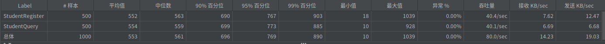
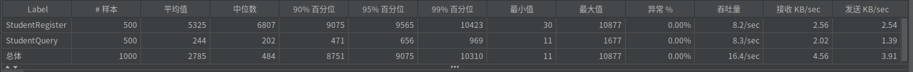

# 优化方案说明

## 优化计划

### 优化思路

在最初的版本里，项目中的`student_service`和`teacher_service`均使用map做存储

```go
var students = make(map[int32]*demo.Student)

// StuRegister implements the StudentServiceImpl interface.
func (s *StudentServiceImpl) StuRegister(ctx context.Context, student *demo.Student) (resp *demo.RegisterResp, err error) {
	// TODO: Your code here...
	if _, ok := students[student.Id]; ok {
		return &demo.RegisterResp{
			Success: false,
			Message: fmt.Sprintf("ID %d 已经注册过了。", student.Id),
		}, nil
	} else {
		students[student.Id] = &demo.Student{
			Id:      student.Id,
			Name:    student.Name,
			College: student.College,
			Email:   student.Email,
		}
		return &demo.RegisterResp{
			Success: true,
			Message: fmt.Sprintf("%s 注册成功。", student.String()),
		}, nil
	}
}

// StuQuery implements the StudentServiceImpl interface.
func (s *StudentServiceImpl) StuQuery(ctx context.Context, req *demo.QueryReq) (resp *demo.Student, err error) {
	// TODO: Your code here...
	resp = students[req.Id]
	if resp == nil {
		resp = &demo.Student{
			Id:      req.Id,
			Name:    "Not Found",
			College: &demo.College{},
			Email:   []string{"Not Found"},
		}
	}
	return
}
```

但这样的实现存在着并发读写的问题，且不能持久化存储

因此，决定使用数据库作为存储，解决并发问题，同时支持持久化存储

### 具体优化方案

使用`gorm`操作`sqlite`数据库，作为项目的存储方案

service启动时初始化数据库：

```go
func (s *StudentServiceImpl) InitDB() {
	db, err := gorm.Open(sqlite.Open("student.db"), &gorm.Config{})
	if err != nil {
		panic(err)
	}

	// drop table
	db.Migrator().DropTable(demo.StudentItem{})
	// create table
	err = db.Migrator().CreateTable(demo.StudentItem{})
	if err != nil {
		panic(err)
	}
	s.db = db
}
```

使用`sqlite`实现service：

```go
type StudentServiceImpl struct {
	db *gorm.DB
}

// StuRegister implements the StudentServiceImpl interface.
func (s *StudentServiceImpl) StuRegister(ctx context.Context, student *demo.Student) (resp *demo.RegisterResp, err error) {
	// TODO: Your code here...
	var stuRes *demo.StudentItem
	result := s.db.Table("student_items").First(&stuRes, student.Id) // result.Error 是失败信息 , result.Error 是 gorm.ErrRecordNotFound 表示没有查询结果，eg: if errors.Is(result.Error, gorm.ErrRecordNotFound) { // 查询结果为空}
	if errors.Is(result.Error, gorm.ErrRecordNotFound) {
		// 为空，ID合法
		result = s.db.Table("student_items").Create(demo.Student2StudentItem(student))
		resp = &demo.RegisterResp{
			Success: true,
			Message: fmt.Sprintf("student_service: %s 注册成功。", student.String()),
		}
	} else {
		// 不为空，ID不合法
		resp = &demo.RegisterResp{
			Success: false,
			Message: fmt.Sprintf("student_service: ID %d 已经注册过了。", student.Id),
		}
	}
	return
}

// StuQuery implements the StudentServiceImpl interface.
func (s *StudentServiceImpl) StuQuery(ctx context.Context, req *demo.QueryReq) (resp *demo.Student, err error) {
	// TODO: Your code here...
	var stuRes *demo.StudentItem
	result := s.db.Table("student_items").First(&stuRes, req.Id)
	if errors.Is(result.Error, gorm.ErrRecordNotFound) {
		resp = &demo.Student{
			Id:      req.Id,
			Name:    "Not Found",
			College: &demo.College{},
			Email:   []string{"Not Found"},
		}
	} else {
		resp = demo.StudentItem2Student(stuRes)
	}
	return
}
```

## 优化效果

### 优化后性能数据

使用jmeter进行测试

在50个线程循环10次的过程中：


优化前：



优化后：



可以看到，在使用数据库之后，吞吐量和接收发送速率略有下降，但完全解决了并发问题